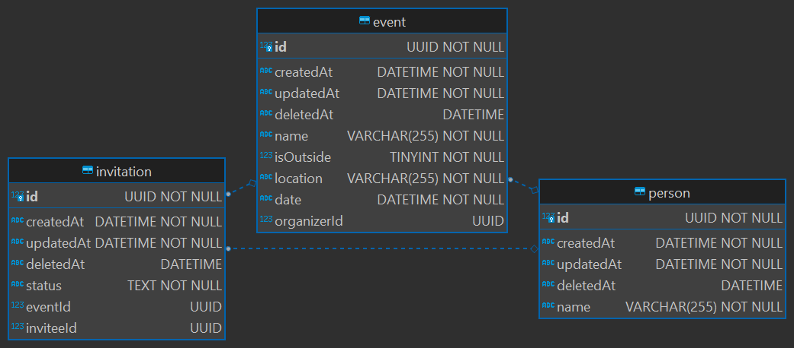

# Notes

## Database

### ORM

I used `sequelize` and `sequelize-typescript` as they're the ORM used by my current company. I hadn't had to deal with much of the intricacies of setting them up so it ended up being more of a stumbling block than I expected. One such example being where/how to define associations, because my initial attempt had it trying to double create the association columns and their foreign keys.
It does provide some very nice features once you're familiar though.

### Tables/Entities

For the purposes of this I only created `event`, `person`, and `invitation` as they're the minimal set to fulfill the objectives (though `invitation` is hinted at but not used). Going forward a table for locations, with values parsed out (eg. city, country, etc.) would make sense.

### Indices

By default all objects had an index created for their `id` column as that's what you're most likely querying on, and then events had an extra 2 indices created for `location` and `date` as those make sense to search on. There's more fields which might benefit from an index, but without seeing the usage of the application it's hard to say.

### Type safety

I attempted to setup some type safe interfaces for the model and their creation, but found it cumbersome and it didn't provide the typing that I was hoping for. If I was to start again, each model would just be themselves (plus perhaps the exposed `I<>CreationAttr`), and there would be a separate layer around the DAOs which would handle the conversions.

I also would avoid having the eager loading of related objects be the default as it adds complexity (which I have just kinda ignored) around conversion. That is, an `invitation` has a `person` which then references that same `invitation` again, repeat till stack overflow. `sequelize` provides `scopes` which help to manage this loading of related data, and I should have made use of them to provide better type clarity.

## Testing

### Completeness

While normally I would write thorough unit tests for each file, I'm assuming that for this it's more to get the idea of how I write tests rather than seeing I write every test. As such, I've created a few example test files to show how I usually write tests, but have not done so for everything.

## Challenges

### Express & error handling

This took way longer than it should have but the `errorHandler` middleware needed to be registered as the last handler for it to correctly intercept the error coming from the routes. While obvious in retrospect, it wasn't communicated by the express docs as well as I would have liked. I also found that while the docs state you can just throw inside a handler, I was finding that didn't work so had to use `next` instead to communicate the error.

### Express & query parameters

I had figured that `express` would provide basic type coercion but it doesn't seem to as far as I can tell. As such I had to do a little bit of less than clean code in the `parseAndValidatePaginationQuery` to handle the `string` case. If I had noticed this earlier I probably would have added a validator and coercion library to better handle this but, I found it pretty late in the process and I don't feel like reworking it :).

### Sequelize where parameters

The `convertRangeToQuery` function took way longer than expected as when declaring an object as type `WhereAttributeHashValue` it then complains about doing something like `obj[Op.gte]` even though it is valid. Never figured that out and just fell back to a `Record` which then was able to be coerced correctly.

## Would like to have done

### Dependency injection

If this was a production app it would be useful to have DI to simplify the creation of things.
I didn't implement it here to keep things simple and quick, but TSyringe is a good option.
It would have been useful for things like creating instances of the logger for each class.

### Context

While there's a request context it would also be useful to have a shared context that services and the like have access to so their logs can be associated with a particular request. I'm not sure how this is best done, but I know that it can be and is very useful when used correctly.

### Caching

A caching layer makes a lot of sense here due to the higher volume of reads compared to writes. That is, people check their calendars much more often then they need to update them. `redis` would be a straight forward solution for this layer.

It would also make sense to cache the results of the weather api calls as that is not likely to change frequently and it's a relatively slow service.

## Misc

### Jest

When using the initial configuration, I was running into issues with the babel transformations and the decorators used for my model files. It seems to be resolved by switching to the `ts-jest` preset and transformer, but this might vary per machine (not sure why it broke in the first place...). While trying to solve the issue I also bumped the `babel` versions to try and resolve it (to no avail).
`ts-jest` also "suggested" (read, printed annoying warnings) that I upgrade to `jest` v28 so I did.

### Validation

Normally we would want better validation on api endpoints, in this case I kept it simple since the endpoints weren't taking in anything too complex. That said, had there been more complexity, using a library like [`ajv`](https://ajv.js.org/) the often the best way to go. This can also be used for validating the transformations between different versions of a DB model (eg. an `event` might not have the `attendees` and `organizer` optimistically loaded, and verifying that it is loaded is useful).

### Ono

`ono` expects an `"ErrorLike"` which doesn't include the `unknown` you get from a catch block. Generally you'd want to not ignore this but that's time consuming and frustrating so just kinda ignoring the issue by casting whenever I use it. Sorry not sorry.

### Naming

`baseModel` is not named `base.model` so it doesn't get picked up by the model auto registration. Annoying but I wasn't really sure how else I wanted to do it.

### Imports

It would be nice to set up an auto barreller & configure proper aliases so things don't have to be relative paths all the time, but decided against.

### node-fetch

For some reason `node-fetch` v3 has issues with imports on node v14, so need to use `node-fetch` v2 instead.

### Id type

Using nominal typing we're able to tell the compiler that while all of these Id's are strings, they actually refer to different things. The benefit of this is that it _should_ be harder to then accidentally use an event id to get a person for example.
